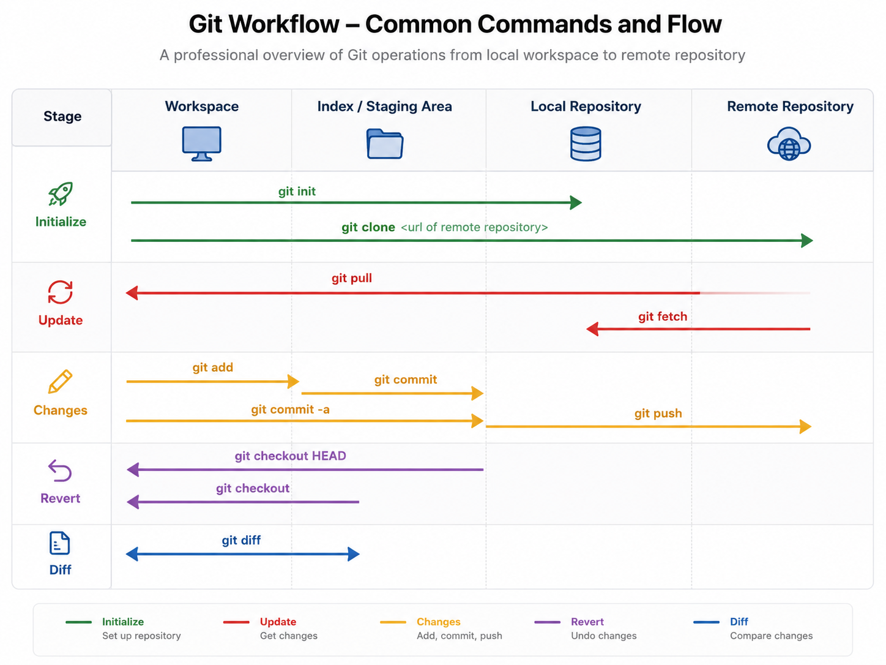

# Git Workflow and Commands

> A practical, developer-focused guide to the **Git workflow** and its most frequently used **commands** — covering configuration, repository management, staging, committing, branching, inspection, undoing changes, stashing, tagging, and more.

> Knowing how changes flow between the **Workspace**, **Staging** area, local **Repository**, and **Remote** makes Git predictable and easy to reason about. This guide documents what I understood in the simplest possible way, which may help others as well.

## Table of Contents

| No. | Topic                                                               |
| --- | ------------------------------------------------------------------- |
| 1   | [Workflow](#1-workflow)                                             |
| 2   | [Configuration](#2-configuration)                                   |
| 3   | [Manage Repository](#3-manage-repository)                           |
| 4   | [Adding Files and Folders](#4-adding-files-and-folders)             |
| 5   | [Committing Changes](#5-committing-changes)                         |
| 6   | [Remote Synchronization](#6-remote-synchronization)                 |
| 7   | [Branching](#7-branching)                                           |
| 8   | [Inspection and History](#8-inspection-and-history)                 |
| 9   | [Discarding and Undoing Changes](#9-discarding-and-undoing-changes) |
| 10  | [Removing Files or Folders](#10-removing-files-or-folders)          |
| 11  | [Stash](#11-stash)                                                  |
| 12  | [Tag](#12-tag)                                                      |
| 13  | [Cherry-pick](#13-cherry-pick)                                      |
| 14  | [Going Deeper](#14-going-deeper)                                    |
| 15  | [References](#15-references)                                        |

## 1. Workflow

Git stores your work in four areas. Think of them as four rooms your code passes through before it reaches your team:

| Area           | What it is                                                                  | Example                          |
| -------------- | --------------------------------------------------------------------------- | -------------------------------- |
| **Workspace**  | Where you create, edit, and delete files                                    | You fix a bug in `index.html`    |
| **Staging**    | A waiting area where you pick exactly which changes go into the next commit | `git add index.html`             |
| **Repository** | Your local commit history, saved on your own machine                        | `git commit -m "Fix header bug"` |
| **Remote**     | The shared copy on GitHub/GitLab that your team sees                        | `git push origin main`           |

A typical round trip looks like this:

1. **Edit** a file → the change appears in the **Workspace**
2. **`git add`** the file → the change moves to the **Staging** area
3. **`git commit`** → the change is saved permanently in the local **Repository**
4. **`git push`** → the change is uploaded to the **Remote**, so teammates can see it

Going the other way:

- **`git fetch`** downloads remote changes into your local **Repository** (without touching your files)
- **`git pull`** downloads remote changes **and** applies them to your **Workspace**

<p align="center">
    
</p>

Every command in this guide simply moves changes from one area to another — keep this picture in mind and Git becomes easy to reason about.

**[⬆ Back to Top](#table-of-contents)**

## 2. Configuration

> **Git config lets you get and set configuration variables that control all aspects of how Git looks and operates.**

```bash
# Display the current Git configuration.
$ git config --list

# Set the user information when submitting code.
$ git config --global user.name "Saiful Islam"
$ git config --global user.email "saifaustcse26@gmail.com"

# Check
$ git config --global user.name
$ git config --global user.email
```

**[⬆ Back to Top](#table-of-contents)**

## 3. Manage Repository

Create a repository in GitHub/GitLab, then clone the repository.

- [How to create a GitHub repository](https://docs.github.com/en/free-pro-team@latest/github/getting-started-with-github/create-a-repo)

```bash
# Download an existing Git repository to your local computer with its entire code history.
$ git clone [url]
```

**[⬆ Back to Top](#table-of-contents)**

## 4. Adding Files and Folders

Moves changes from the **Workspace** to the **Staging** area.

```bash
# Add the specified files from the current directory to the staging.
# Start tracking untracked files.
$ git add [file1] [file2] [fileN]

# Add the specified directory from the current directory to the staging, including subdirectories.
# Start tracking an untracked directory.
$ git add [dir]

# Add all files (tracked or untracked) from the current directory to the staging.
# Start tracking untracked files.
# Update the changes of tracked files from the current directory to the staging.
$ git add .
```

**[⬆ Back to Top](#table-of-contents)**

## 5. Committing Changes

Submits the staged code to the local **Repository** with a message.

```bash
# Submit the code from the staging to the repository with a message.
$ git commit -m [message]

# Submit the specified files from the staging to the repository.
$ git commit [file1] [file2] [fileN] -m [message]

# Display all diff information when submitting.
$ git commit -v

# Update and replace the most recent commit with a new commit.
$ git commit --amend
```

Commit directly from the **Workspace** to the **Repository** (skips explicit staging):

```bash
# Submit the changes of all tracked files after the last commit.
$ git commit -am [message]

# For untracked files, stage them first.
$ git add .
$ git commit -am [message]
```

**[⬆ Back to Top](#table-of-contents)**

## 6. Remote Synchronization

Synchronizes work between the local **Repository**, the **Workspace**, and the **Remote** repository.

```bash
# Push the current branch to the remote repository. (Repository --> Remote)
$ git push origin [branch]

# Download a specific branch. (Repository <-- Remote)
$ git fetch origin [branch]

# Download all remote branches.
$ git fetch --all

# Merge the specified branch into the current branch. (Workspace <-- Repository)
$ git merge [branch]

# Merge a branch into a target branch.
$ git merge [source branch] [target branch]

# Retrieve the changes from the remote repository and merge them with the local branch. (fetch + merge)
$ git pull origin [branch]
```

**[⬆ Back to Top](#table-of-contents)**

## 7. Branching

> **A branch is an independent line of development. It lets you work on features or fixes without affecting the main codebase.**

```bash
# List all local branches. (the asterisk denotes the current branch)
$ git branch

# List all remote branches.
$ git branch -r

# List all local branches and remote branches.
$ git branch -a

# Create a new branch, but still stay in the current branch.
$ git branch [branch-name]

# Create a new branch and switch to the branch.
$ git checkout -b [branch]

# Switch to the specified branch.
$ git checkout [branch-name]

# Switch to the previous branch.
$ git checkout -

# Delete the branch.
$ git branch -d [branch-name]

# Delete the remote branch.
$ git push origin --delete [branch-name]
$ git branch -dr [remote/branch]
```

**[⬆ Back to Top](#table-of-contents)**

## 8. Inspection and History

Displays the state of the **Workspace**, the **Staging** area, and the version history of the current branch.

```bash
# Display the changed files.
$ git status

# Display the version history of the current branch.
$ git log

# Display all commits. (custom filtering)
$ git log --all

# Display the 5 most recent commits. (custom filtering)
$ git log -5

# View commit history in ASCII graph.
$ git log --graph

# Display just one line per commit.
$ git log --oneline

# Display just one line per commit with message. (custom formatting)
$ git log --pretty=oneline

# Display all the users who have committed, sorted by number of commits.
$ git shortlog -sn

# Show the latest commits of the current branch.
$ git reflog
```

For more details:

- [The official Git site](https://git-scm.com/book/en/v2/Git-Basics-Viewing-the-Commit-History)
- [Atlassian](https://www.atlassian.com/git/tutorials/git-log)

**[⬆ Back to Top](#table-of-contents)**

## 9. Discarding and Undoing Changes

Git provides several ways to discard or undo work, depending on which area the changes have reached.

### Discard changes from Workspace

```bash
# Discard changes from the specified file of the workspace.
$ git checkout [file]

# Discard all changes of the workspace.
$ git checkout .
```

### Revoke/Undo from Staging (Workspace ← Staging)

```bash
# If unwanted files were added to the staging area but not yet committed.
# Restore specified file from the staging to the workspace.
# Changes will stay in the workspace.
$ git reset [file]

# Restore all files from the staging to the workspace.
# Changes will stay in the workspace.
$ git reset
$ git reset HEAD .

# Restore all files from the staging to the workspace.
# All changes will be discarded.
$ git reset --hard
```

### Revoke/Undo from Repository (Workspace ← Staging ← Repository)

```bash
# Restore all files from the repository to the workspace.
# All changes will stay in the workspace.
# Undo the last commit.
$ git reset HEAD~1
$ git reset --mixed HEAD~1

# Restore all files from the repository to the staging.
# All changes will stay in the staging.
# Undo the last commit.
$ git reset --soft HEAD~1

# Restore all files from the repository to the workspace.
# All changes will be discarded.
# Undo the last commit.
$ git reset --hard HEAD~1
```

### Revoke/Undo from Remote (Workspace ← Staging ← Repository ← Remote)

```bash
# Create a new commit to undo the specified commit.
# All changes of the latter will be offset by the former and applied to the current branch.
# This is safe.
$ git revert [commit]
$ git commit -m "message"
$ git push origin [branch]
```

**[⬆ Back to Top](#table-of-contents)**

## 10. Removing Files or Folders

Permanently removes files or folders from the **Workspace**, the **Repository**, and the **Remote**.

```bash
# Manually delete the files or folders from the workspace.
# The following commands will permanently remove the files or folders.
$ git add .
$ git commit -m "message"
$ git push origin [branch]
```

**[⬆ Back to Top](#table-of-contents)**

## 11. Stash

> **Stash temporarily saves (or stashes) changes of the working copy so you can move them in later, letting you switch branches without committing unfinished work.**

```bash
# Temporarily save or stash changes of the working copy and move them in later.
$ git stash

# Saving stashes with a message.
$ git stash save "<Stashing Message>"

# Check the stored stashes.
$ git stash list

# Restore the changes of the latest stash from stashes.
# Remove the latest stash from stashes.
$ git stash pop

# Restore the changes of the latest stash from stashes.
$ git stash apply

# Restore the changes of a specific stash from stashes.
$ git stash apply <stash id>

# Remove the latest stash from stashes.
$ git stash drop

# Remove a specific stash from stashes.
$ git stash drop <stash id>

# Remove all stashes.
$ git stash clear
```

**[⬆ Back to Top](#table-of-contents)**

## 12. Tag

> **A tag is nothing but a reference name of a commit. Use tags to create release points for stable versions. Multiple tag names are possible for the same commit.**

```bash
# List all tags.
$ git tag

# Create a new tag in the current commit.
$ git tag [tag_name]

# Create a new tag in the specified commit.
$ git tag [tag] [commit]

# Delete the local tag.
$ git tag -d [tag_name]

# Push the specified tag to remote.
$ git push origin [tag_name]

# Push all tags to remote.
$ git push origin --tag

# Delete the remote tag.
$ git push origin :refs/tags/[tag_name]

# View the tag information.
$ git show [tag_name]

# Create a new branch pointing to a certain tag.
$ git checkout -b [branch] [tag]
```

**[⬆ Back to Top](#table-of-contents)**

## 13. Cherry-pick

```bash
# Select a commit to be merged into the current branch.
$ git cherry-pick [commit]
```

**[⬆ Back to Top](#table-of-contents)**

## 14. Going Deeper

- [Checkout vs Reset vs Revert – Atlassian](https://www.atlassian.com/git/tutorials/resetting-checking-out-and-reverting)
- [Merge vs Rebase, Reset vs Revert vs Checkout – Medium](https://medium.com/@manivel45/git-merge-vs-rebase-reset-vs-revert-vs-checkout-dd5674d0e18a)
- [Git Reset, Revert and Rebase Commands – opensource](https://opensource.com/article/18/6/git-reset-revert-rebase-commands)
- [Merging vs. Rebasing – Atlassian](https://www.atlassian.com/git/tutorials/merging-vs-rebasing)

**[⬆ Back to Top](#table-of-contents)**

## 15. References

I have followed many articles but among them, the following articles are really helpful. Those articles helped me a lot and also encouraged me to write this article according to my understanding.

- [The official Git site](https://git-scm.com/book/en/v2)
- [Atlassian](https://confluence.atlassian.com/bitbucketserver/basic-git-commands-776639767.html)
- [Git most frequently used commands](https://medium.com/analytics-vidhya/git-most-frequently-used-commands-9df9f200c235)
- [Ercankaracelik](https://ercankaracelik.wordpress.com/2018/12/08/basic-git-commands/)
- [Tutorialdocs](https://www.tutorialdocs.com/article/git-basic-command-list.html)

**[⬆ Back to Top](#table-of-contents)**

## Author

**Md. Saiful Islam**
_Microsoft Certified Solutions Developer (MCSD) – Programming in C#_

**GitHub:** [@saifaustcse](https://github.com/saifaustcse)
**LinkedIn:** [Md. Saiful Islam](https://www.linkedin.com/in/saif-aust-cse/)

If you find this guide useful, please give :star:. Your support is appreciated!
